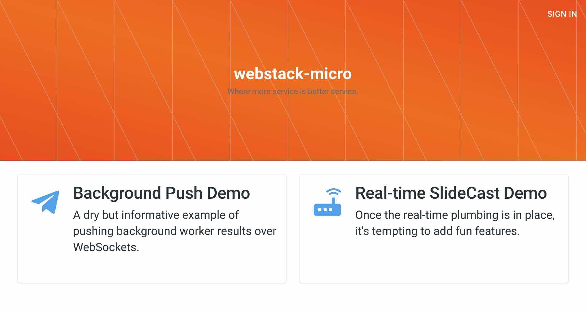

# webstack-micro

This repository is a starter/boilerplate web app intended for teams of under ~ 20 developers who want to pluck the main advantages
 of a microservices architecture for their project while trying to minimize its extra complexity and overhead. Webstack-micro
 is monolithic-friendly, you can use it with an existing web app built in Django/Laravel/Nest/Rails/etc. 
 

Goals:

* offer "background push" functionality out of the box, such that slow/heavy jobs can be passed to background workers that push
 results to the user over WebSockets; 
* offer authentication functionality out of the box;    
* work offline on a local dev system without having to set up any third-party API keys; 
* minimize learning curve for new developers; optimize for a pleasant (tolerable?) dev environment;       
* permit a quick start, such that a team can focus on their own features immediately; ability to deploy a demo server today. 

I couldn't find a starter or demo offering anything near these goals so I'm cobbling something together. Webstack-micro is very new 
 but it might give teams a nice jump start. Contributions are welcome.   




See also: [HackerNoon article](https://hackernoon.com/docker-kubernetes-and-microservices-for-small-teams-noym30kb) covering its pros & cons. 
  

### What is it

Webstack-micro uses [Docker Compose](https://docs.docker.com/compose/) to assemble a handful of containerized services. Your application 
 runs as 1-3 of these services, depending on how you want to structure your app. Your code interacts with the provided services, ones 
 that are fairly common and popular to web apps, ideally requiring little configuration or modification. The services:      
 
* **services/traefik-gateway** is the entry point for all HTTP requests. It is a [Traefik](https://traefik.io) server (aka 
 edge router / load balancer / API gateway.) You'll modify its configuration when you want to change which routes are protected (those  
 requiring login or API key) or to change its HTTPS/TLS configuration. You might later use some of its other features, like API rate limits.

* **services/passportjs-auth**: handles authentication for all of the protected routes behind our *traefik-gateway*. When such a
 request arrives, Traefik asks *passportjs-auth* if it should be permitted to pass. *Passportjs-auth* also acts as a back-end controller for
 authentication-related end points, handling Oauth/OpenId Connect requests (eg, "Login With Google") and decoding JWT access 
 tokens to support third-party API calls. For approved requests, it instructs *traefik-gateway* to modify the incoming request 
 header, adding auth-related data that the destination service (your code) uses instead of doing its own authentication. (Eg, "X-AUTH-EMAIL" 
 would include the logged-in user's email address.) 
                                                
* Your code runs in **services/frontend-web**, **services/backend-api**, and **services/background-worker**. In the provided example,
 the *background-worker* service shares the same code directory as the *backend-api*, with one starting as an http server and one
 as a background worker. The example separates out the front end source into its own service (*frontend-web*) that runs a 
 Webpack-based toolchain in dev mode and an Nginx static file server in production mode. (Or you can use a CDN.)   

* **services/websocket-push** is responsible for browser WebSocket connections. Other services pass it messages over Redis pub-sub, 
 specifying if the message should be sent to clients that subscribed to a room, to a single tab window, or to all tabs open for a user. 
    
* **services/redis-main** is a Redis container used by *passportjs-auth* for holding session state and for pub-sub communication between
 services. The example web app also uses Redis as a placeholder for model-layer persistence (intended to be discarded.) **services/postgres-main** 
 is set up for you but is not used in the example. 
    
* **services/rabbitmq-broker** is a RabbitMQ server used in the example for enqueuing background jobs. It could also be used for reliable 
 service-to-service communication, pub-sub, and other messaging-related functionality. RabbitMQ is popular but is also relatively 
 heavy--you can remove the service if it's not appropriate to your project.    
    

To make it easy to find example uses or to entirely replace a service, each uses a name that is two words long and is unique 
 to this repository, such that you can find occurrences. A regular expression like: `/backend[_-]?api/i` would match BackendApi, 
 backend-api, etc, and find all of its uses. 

**Each service above has its own README with instructions and suggestions.**    
 
 
### Experimental Status! 

This repo is an experimental side project. Most is untested and it has never been used in production. I decided to share this 
 early draft because teams might still find it useful to look at as an example.  

I'll put more time into it if other people end up contributing. If so, we might publish the general/reusable services as 
 versioned, maintained containers. 
     
  
### Example app

The example demonstrates using background-push and (mostly for fun) a realtime slidecast. 

The example is NOT my ideal tech stack. I just tried to pick popular libraries that also have a light footprint. 

You'll almost certainly want to remove or replace *frontend-web*, *backend-api*, and *background-worker*. Portions are worth 
 examining first--mainly how each service interacts with the others. Each README mentions what's worth a look.       

If you think your Dockerfile or setup is something others might also like, consider sharing your notes as [a guide](./guides/adding-a-guide) 
 in this repository.   
  

## Development Mode

### Instructions

* Download this repository
  * you can rename the top/root directory from webpack-micro to your project name
  * if you used git clone, you'll probably want to remove `.git` and start your own `git init .`  

* Set up environment variables

      cp env.development.example .env 

  * **note:** if you plan on using Postgres in your project, make sure you set the postgres-related vars **now**. (Its Docker
     build script creates a database and user based on their values.)  
      
* Ensure [Docker](https://docs.docker.com/) permissions are ok:
  * and of course, [download and install](https://download.docker.com/) Docker if you haven't already     
  * Ensure its File Sharing setting grants containers permission to access either this entire repository, or `./mounted-volumes` and `./shared-constants` 

* Run the initialization script: `bin/init-dev-system.sh`
  * the script builds the Docker containers, installs dev-mode dependencies (eg, yarn install), and ensures expected data directories exist   
  * the first run is slow...... (took ~ 8 minutes on an old MacBook Pro) 

* Set up your localhost base domain
  * It's best to add a couple base domains to `/etc/hosts`:
      
        sudo echo 127.0.0.1 webstack.loc >> /etc/hosts
        sudo echo 127.0.0.1 ws.webstack.loc >> /etc/hosts
    
  * You can replace "webstack.loc" here and in the .env shell variables, but the READMEs refer to it as "webstack.loc"         
  * If you do not have permission to /etc/hosts, you can use another domain that points back to localhost 127.0.0.1 like: *lvh.me*      
  * note: needed because navigating to your site using "http://localhost" or "http://127.0.0.1" confounds open id login, session cookies, and ssl on localhost 

* Give it a try 
  * Stop any containers still lingering from the installation: `bin/dev.sh stop`
  * Start the servers: `bin/dev.sh up` 
  * Visit `http://webstack.loc`
  * Create a local dev-mode account for login: `bin/dev.sh run passportjs-auth bin/create-dev-user.js dev@email.loc secret! Some Name`                                         
  
* Take a look at the tips and instructions in each service's README file.  
 

### Docker Cheat Sheet

The `bin/dev.sh` script is a very short shell script--it is just a passthrough to the official Docker Compose binary, setting
 the "-f" options for you, telling it to run with the settings defined in both `docker-compose.common.yml` and `docker-compose.development.yml`. 
   

* start your project: 
    ```
    bin/dev.sh up    
    ```
  
  note: if a Dockerfile changed, append a `--build` switch (or run `bin/dev.sh build`)  

* stop all running containers: 

      bin/dev.sh stop

* make sure they really stopped:

      docker ps

* stop them harder: 

      docker stop $(docker ps -q)

* find and start bash shell on an already-running container. Eg, to connect to running backend-api:

      docker exec -it `docker ps --filter name=backend -q` bash

    * note: the non-local containers may not have bash installed (like *postgres-main*); use `sh` instead of `bash` for these
    * note: if more than one is running, run `docker ps`, select the *image id* desired, eg: `docker exec -it abc123dd sh` 

* restart a single container:

      bin/dev.sh restart passportjs-auth 

    * note: this won't pick up changes made to the Docker Compose config since running *up*.
        
* run a specific container and its dependencies instead of the entire project:
      
      bin/dev.sh run --service-ports backend-api 

    * note: You need the *--service-ports* switch 
           
* Show memory and CPU usage for running containers: 

      docker stats 


## Security

First, the development environment is not at all secure, don't deploy it to even a demo server. In dev mode, most services 
 accept trusted requests (where you can include the service's port to reach it directly), bypassing authentication and all 
 routing/networking restrictions--convenient for troubleshooting in dev mode but fantastically insecure. 

The setup for demo mode secures the outer perimeter, where all requests go through *traefik-gateway*. However, 
 it permits internal services to directly contact other internal services on the inner network. Should one service be compromised, 
 the bad guys would be able to make requests disguised as an authenticated user, connect to databases, etc.   
 
To further harden your app:

* Consider adding access controls as an additional layer of security. 
    * You might require all communication between services go through RabbitMQ, using its access control functionality to 
       restrict services to a whitelist of topics/queues  
    * You might set granular authorization restrictions on requests sent between services using JWT tokens (or with some other cryptographic signature)
     
* Consider investigating if sub-networks might provide an effective layer of security for your setup 
 
* Consider manging your keys/passwords/secrets with a purpose-built tool like Vault, Nomad, Docker Secrets, Kubernetes Secrets, etc.  
   

See also the **security notes in individual services' README files**, particularly: passportjs-auth; rabbitmq-broker; redis-main.     
 